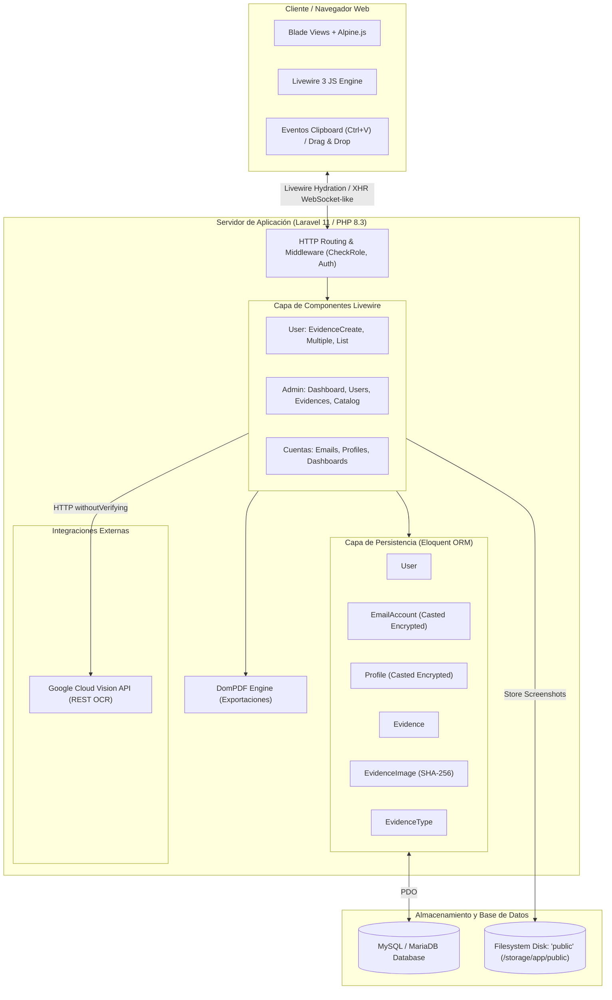
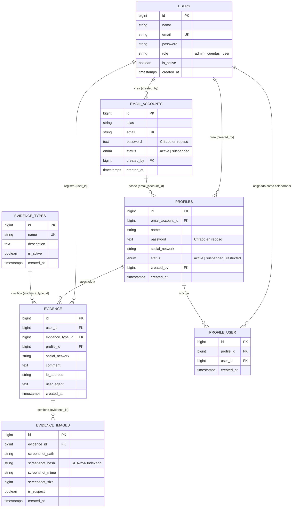
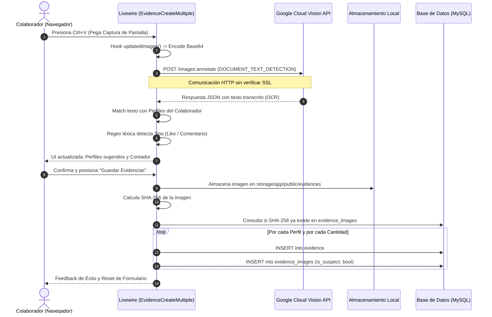

# 📑 Reporte de Auditoría de Arquitectura, Módulos y Seguridad: TraceX

**Fecha de Auditoría:** 07 de Octubre de 2026  
**Auditor:** Ingeniero de Sistemas Senior / Arquitecto de Software  
**Proyecto:** TraceX (Sistema Interno de Auditoría y Control de Operaciones de Marketing Digital)  
**Versión de Referencia:** v1.0.2 / Laravel 11.x (PHP 8.3)

---

## 1. Resumen Ejecutivo (Executive Summary)

### 1.1 Naturaleza y Propósito del Negocio
**TraceX** es una plataforma interna orientada a la supervisión operativa y control de calidad de campañas de marketing digital. Su objetivo primordial es gestionar el inventario de identidades digitales de la empresa (cuentas de correo electrónico y perfiles en redes sociales como Facebook, Instagram, X, TikTok, LinkedIn y YouTube), asignarlas a colaboradores específicos y fiscalizar la ejecución de interacciones orgánicas (likes, comentarios, compartidos) mediante la recepción, procesamiento y auditoría de evidencias gráficas (capturas de pantalla).

### 1.2 Diagnóstico General
El sistema implementa una arquitectura monolítica reactiva moderna basada en el **TALL Stack** (`Tailwind CSS`, `Alpine.js`, `Laravel`, `Livewire 3`). Presenta características de alto valor funcional, como la captura rápida vía portapapeles (`Ctrl+V`), escaneo óptico automatizado mediante **Google Cloud Vision OCR**, detección criptográfica de duplicados por hash SHA-256 y herramientas de administración masiva de inventarios.

Sin embargo, desde la perspectiva de ingeniería senior, el sistema presenta **deuda técnica estructural y riesgos críticos de seguridad y escalabilidad**:
- **Seguridad:** Existen fallos de Control de Acceso Roto (**IDOR**) en la creación de evidencias y asignaciones masivas, desactivación de verificación SSL en llamadas salientes de IA, almacenamiento de capturas confidenciales en almacenamiento público y políticas de autorización (`Policies`) huérfanas que no se invocan.
- **Rendimiento:** Presencia de cuellos de botella por consultas **N+1**, llamadas síncronas a APIs de terceros durante el ciclo de vida de la UI, y alto riesgo de saturación de memoria (**OOM**) en exportaciones PDF/CSV ante grandes volúmenes de datos.
- **Mantenibilidad:** Sobrecarga de responsabilidades en los componentes Livewire (*Fat Components*) sin una capa intermedia de Servicios o Acciones de dominio.

---

## 2. Arquitectura Global del Sistema



### 2.1 Stack Tecnológico Evaluado
- **Framework Base:** [Laravel 11.x](file:///C:/Users/GOroz/OneDrive/Escritorio/TraceX/tracex/composer.json#L12) en entorno PHP 8.3.
- **Motor Reactivo:** [Livewire 3.6](file:///C:/Users/GOroz/OneDrive/Escritorio/TraceX/tracex/composer.json#L15) con [Volt 1.7](file:///C:/Users/GOroz/OneDrive/Escritorio/TraceX/tracex/composer.json#L16).
- **Frontend & Reactividad de Cliente:** [Alpine.js](file:///C:/Users/GOroz/OneDrive/Escritorio/TraceX/tracex/resources/views/livewire/user/evidence-create.blade.php#L31) para gestión de portapapeles, dropdowns dinámicos y modal states.
- **Capa Visual:** Tailwind CSS v3/v4 compilado mediante [Vite 8](file:///C:/Users/GOroz/OneDrive/Escritorio/TraceX/tracex/package.json#L17).
- **Exportación de Documentos:** [barryvdh/laravel-dompdf 3.1](file:///C:/Users/GOroz/OneDrive/Escritorio/TraceX/tracex/composer.json#L10).
- **Servicios Cloud:** Google Cloud Vision API REST (`DOCUMENT_TEXT_DETECTION`).

### 2.2 Patrón Arquitectónico Actual
El software sigue un patrón **Full-Stack Monolith (TALL)** con enfoque *Component-Driven*. En lugar de la tríada clásica MVC (Ruta -> Controlador -> Vista), la lógica de negocio y presentación está acoplada directamente dentro de los componentes Livewire ubicados en [`app/Livewire/`](file:///C:/Users/GOroz/OneDrive/Escritorio/TraceX/tracex/app/Livewire/). No existe una capa formal de Repositorios, Servicios de Dominio (`Services`) ni Clases de Acción (`Actions`).

---

## 3. Modelo de Datos y Esquema Relacional

El modelo relacional está sólidamente estructurado en torno a 6 entidades principales y una tabla pivote para asignaciones muchos a muchos:



---

## 4. Análisis Detallado por Módulos Funcionales

### 4.1 Módulo 1: Autenticación, Roles y Control de Acceso (RBAC)
- **Roles Implementados:**
  1. `admin`: Control absoluto del sistema, catálogo de tipos, gestión de usuarios, auditoría global y eliminación de registros.
  2. `cuentas`: Administrador de inventario. Registra correos y perfiles, asigna colaboradores, transfiere cuentas y revela credenciales de sus elementos creados.
  3. `user` (Colaborador): Personal de operaciones de marketing. Consulta únicamente sus perfiles asignados, registra evidencias individuales o masivas y visualiza su propio historial.
- **Mecanismos de Guardia:**
  - El middleware [`CheckRole`](file:///C:/Users/GOroz/OneDrive/Escritorio/TraceX/tracex/app/Http/Middleware/CheckRole.php) valida los parámetros pasados en las rutas (`role:admin`, `role:admin,cuentas`, etc.).
  - En [`LoginForm`](file:///C:/Users/GOroz/OneDrive/Escritorio/TraceX/tracex/app/Livewire/Forms/LoginForm.php#L36), se bloquea explícitamente el acceso si `is_active` es `false`, complementado con rate limiting por IP y correo.
  - El autorregistro público está deshabilitado en [`routes/auth.php`](file:///C:/Users/GOroz/OneDrive/Escritorio/TraceX/tracex/routes/auth.php#L8), garantizando el carácter estrictamente privado del aplicativo.

### 4.2 Módulo 2: Gestión de Cuentas de Correo
- **Ubicación:** [`App\Livewire\Admin\Emails\Index`](file:///C:/Users/GOroz/OneDrive/Escritorio/TraceX/tracex/app/Livewire/Admin/Emails/Index.php).
- **Seguridad Criptográfica:** El campo `password` del modelo [`EmailAccount`](file:///C:/Users/GOroz/OneDrive/Escritorio/TraceX/tracex/app/Models/EmailAccount.php#L14) utiliza el cast nativo `'encrypted'`, garantizando que las contraseñas residan cifradas mediante AES-256-CBC en la base de datos.
- **Funcionalidad Destacada:** Reasignación masiva de cuentas (`executeMassAssignment`) entre gestores (`created_by`), transfiriendo simultáneamente todos los perfiles asociados a esas cuentas.

### 4.3 Módulo 3: Catálogo y Asignación de Perfiles Sociales
- **Ubicación:** [`App\Livewire\Admin\Profiles\Index`](file:///C:/Users/GOroz/OneDrive/Escritorio/TraceX/tracex/app/Livewire/Admin/Profiles/Index.php).
- **Relaciones:** Cada perfil pertenece obligatoriamente a una cuenta de correo (`email_account_id`) y puede ser vinculado a múltiples colaboradores (`belongsToMany(User::class)`).
- **Estados Operativos:** Soporta `active`, `suspended` y `restricted` (para perfiles temporalmente sancionados por algoritmos de las redes sociales).
- **Asignación en Lote:** Permite migrar perfiles de un colaborador origen a un colaborador destino en bloque.

### 4.4 Módulo 4: Registro y Auditoría de Evidencias (Core del Negocio)
Este es el módulo central del sistema y cuenta con tres variantes operativas:

#### A. Captura Individual ([`EvidenceCreate.php`](file:///C:/Users/GOroz/OneDrive/Escritorio/TraceX/tracex/app/Livewire/User/EvidenceCreate.php))
- Integra un listener de ventana en Alpine.js que intercepta el evento `@paste.window`, capturando imágenes directamente del portapapeles (`Ctrl+V`) y enviándolas mediante `uploadMultiple`.
- Registra metadatos de auditoría forense: dirección IP del cliente (`request()->ip()`) y agente de usuario (`request()->userAgent()`).

#### B. Captura Masiva Asistida por IA OCR ([`EvidenceCreateMultiple.php`](file:///C:/Users/GOroz/OneDrive/Escritorio/TraceX/tracex/app/Livewire/User/EvidenceCreateMultiple.php))
- **Flujo de Escaneo:**
  1. Al cargar la captura, el hook `updatedImages()` codifica el archivo a Base64.
  2. Realiza una petición POST a `https://vision.googleapis.com/v1/images:annotate` invocando la función `DOCUMENT_TEXT_DETECTION`.
  3. Ejecuta coincidencia de cadenas normalizadas (`mb_strtolower`) entre el texto detectado y los nombres de los perfiles asignados al usuario.
  4. Analiza expresiones regulares léxicas (`like`, `gusta`, `coment`, `comparti`) para autoseleccionar el `EvidenceType`.
  5. Calcula la recurrencia del nombre para sugerir el volumen de evidencias a crear (`quantity`).
  6. Guarda las imágenes una sola vez en disco y genera $N \times M$ registros de evidencias en un bucle estructurado.



#### C. Detección Anti-Fraude (Imágenes Sospechosas)
- Al momento de procesar cada imagen, se genera su huella criptográfica SHA-256 (`hash_file('sha256', ...)`).
- Si el hash ya existe previamente en la tabla `evidence_images`, el registro se marca con la bandera `is_suspect = true`.
- En el panel de administración ([`Admin\Evidences\Index.php`](file:///C:/Users/GOroz/OneDrive/Escritorio/TraceX/tracex/app/Livewire/Admin/Evidences/Index.php#L40)), los administradores cuentan con un modal comparativo que coteja lado a lado la evidencia actual contra la imagen original histórica donde apareció por primera vez el hash, permitiendo desestimar o validar la sospecha.

### 4.5 Módulo 5: Analítica y Reportes
- **Dashboards Segmentados:** Tres paneles diferenciados para Administradores (gráficas de rendimiento, distribución por red social y gestor), Cuentas (conteos semanales/mensuales de inventario) y Usuarios (métricas individuales).
- **Exportación Dual:**
  - **CSV:** Generación con `response()->streamDownload` y cabecera UTF-8 BOM (`\xEF\xBB\xBF`) para compatibilidad nativa con Microsoft Excel.
  - **PDF:** Renderizado vectorial mediante `Barryvdh\DomPDF\Facade\Pdf` con maquetación paginada profesional, numeración dinámica CSS y cabeceras repetitivas.

---

## 5. Auditoría Técnica: Hallazgos, Vulnerabilidades y Riesgos

A continuación se detalla la matriz de hallazgos clasificados bajo los estándares OWASP y principios de ingeniería de software:

### 5.1 🔴 Riesgos Críticos y de Seguridad

#### [SEC-01] Control de Acceso Roto (IDOR) en la Creación de Evidencias
- **Archivo:** [`app/Livewire/User/EvidenceCreate.php:58`](file:///C:/Users/GOroz/OneDrive/Escritorio/TraceX/tracex/app/Livewire/User/EvidenceCreate.php#L58) y [`EvidenceCreateMultiple.php:136`](file:///C:/Users/GOroz/OneDrive/Escritorio/TraceX/tracex/app/Livewire/User/EvidenceCreateMultiple.php#L136)
- **Vulnerabilidad:** La regla de validación es `'profile_id' => 'required|exists:profiles,id'`. No existe ninguna verificación de que el perfil pertenezca a la colección `auth()->user()->assignedProfiles()`.
- **Impacto:** Cualquier usuario autenticado puede interceptar la solicitud de Livewire y forzar un `profile_id` de cualquier otro usuario o cliente, creando evidencias fraudulentas a nombre de cuentas ajenas.

#### [SEC-02] Desactivación de Validación de Certificados SSL en OCR
- **Archivo:** [`app/Livewire/User/EvidenceCreateMultiple.php:51`](file:///C:/Users/GOroz/OneDrive/Escritorio/TraceX/tracex/app/Livewire/User/EvidenceCreateMultiple.php#L51)
- **Código Vulnerable:**
  ```php
  $response = \Illuminate\Support\Facades\Http::withoutVerifying()->post(...)
  ```
- **Impacto:** Al emplear `withoutVerifying()`, el canal de comunicación hacia Google Cloud queda completamente expuesto a ataques de intermediario (**Man-in-the-Middle - MitM**). Un atacante en la red puede capturar la `GOOGLE_VISION_API_KEY` y las capturas enviadas en base64.

#### [SEC-03] Almacenamiento de Evidencias en Disco Público sin Control de Acceso
- **Archivo:** [`EvidenceCreate.php:82`](file:///C:/Users/GOroz/OneDrive/Escritorio/TraceX/tracex/app/Livewire/User/EvidenceCreate.php#L82)
- **Código:** `$path = $image->store('evidences', 'public');`
- **Impacto:** Los archivos se almacenan en `storage/app/public/evidences/` expuestos al directorio web raíz vía enlace simbólico. Cualquier tercero que conozca o adivine la ruta puede ver las capturas confidenciales sin pasar por autenticación ni políticas de acceso.

#### [SEC-04] Políticas de Autorización (`Policies`) Huérfanas
- **Archivos:** [`app/Policies/EvidencePolicy.php`](file:///C:/Users/GOroz/OneDrive/Escritorio/TraceX/tracex/app/Policies/EvidencePolicy.php) y [`app/Policies/UserPolicy.php`](file:///C:/Users/GOroz/OneDrive/Escritorio/TraceX/tracex/app/Policies/UserPolicy.php)
- **Problema:** Ambas clases definen reglas de acceso detalladas, pero en ningún componente Livewire se invoca `$this->authorize()`. La seguridad depende exclusivamente de filtros de rol globales en las rutas y sentencias `if/abort` dispersas.

#### [SEC-05] Fuga de Credenciales sin Registro de Auditoría
- **Archivo:** [`app/Livewire/Admin/Emails/Index.php:177`](file:///C:/Users/GOroz/OneDrive/Escritorio/TraceX/tracex/app/Livewire/Admin/Emails/Index.php#L177) y [`Profiles/Index.php:252`](file:///C:/Users/GOroz/OneDrive/Escritorio/TraceX/tracex/app/Livewire/Admin/Profiles/Index.php#L252)
- **Problema:** El método `revealPassword()` expone contraseñas descifradas directamente hacia el estado público del componente Livewire (`$this->revealedPassword`). No existe ninguna tabla de auditoría (`audit_logs`) que registre la fecha, hora, usuario e IP de quien reveló las contraseñas.

---

### 5.2 🟠 Rendimiento y Escalabilidad

#### [PERF-01] Consulta N+1 en Dashboard de Administración
- **Archivo:** [`app/Livewire/Admin/Dashboard.php:189-194`](file:///C:/Users/GOroz/OneDrive/Escritorio/TraceX/tracex/app/Livewire/Admin/Dashboard.php#L189-L194)
- **Código:**
  ```php
  ->map(function ($a) {
      $user = User::find($a->created_by); // N+1 Query individual por cada creador
      return ['name' => $user ? $user->name : 'N/A', 'count' => $a->count];
  })
  ```
- **Impacto:** Si existen 100 gestores, el dashboard ejecuta 101 consultas a la base de datos en lugar de resolverlo mediante un simple `join` o `with('creator')`.

#### [PERF-02] Riesgo de Agotamiento de Memoria (OOM) en Exportaciones
- **Archivos:** [`Admin/Evidences/Index.php:134,159`](file:///C:/Users/GOroz/OneDrive/Escritorio/TraceX/tracex/app/Livewire/Admin/Evidences/Index.php#L159), [`Admin/Emails/Index.php:260`](file:///C:/Users/GOroz/OneDrive/Escritorio/TraceX/tracex/app/Livewire/Admin/Emails/Index.php#L260), [`Admin/Profiles/Index.php:338`](file:///C:/Users/GOroz/OneDrive/Escritorio/TraceX/tracex/app/Livewire/Admin/Profiles/Index.php#L338)
- **Código:** `$evidences = $this->buildQuery()->get();`
- **Impacto:** Cargar decenas de miles de registros y modelos hidratados a memoria en una sola llamada colapsará el proceso PHP con `Fatal Error: Allowed memory size exhausted` al pasárselo al motor DOMPDF (el cual consume una cantidad exponencial de memoria para parsear HTML).

#### [PERF-03] Ejecución Síncrona Bloqueante de Google Cloud Vision
- **Archivo:** [`EvidenceCreateMultiple.php:51`](file:///C:/Users/GOroz/OneDrive/Escritorio/TraceX/tracex/app/Livewire/User/EvidenceCreateMultiple.php#L51)
- **Problema:** La llamada a la API de Google ocurre dentro del ciclo de vida síncrono del componente Livewire durante la subida del archivo. Si la API de Google experimenta latencia (2 a 5 segundos), la interfaz del usuario queda totalmente congelada esperando respuesta.

#### [PERF-04] Limitaciones del Algoritmo Anti-Fraude (SHA-256 vs Perceptual Hash)
- **Archivo:** [`EvidenceCreate.php:83`](file:///C:/Users/GOroz/OneDrive/Escritorio/TraceX/tracex/app/Livewire/User/EvidenceCreate.php#L83)
- **Problema:** El hash criptográfico SHA-256 detecta únicamente duplicados exactos a nivel de bytes. Si un usuario recorta 1 píxel la captura, altera ligeramente el brillo o guarda la imagen con una compresión diferente, el SHA-256 cambia por completo, burlando el detector de fraude.

#### [PERF-05] Falta de Transacciones Atómicas (`DB::transaction`)
- **Archivos:** [`EvidenceCreateMultiple.php:178`](file:///C:/Users/GOroz/OneDrive/Escritorio/TraceX/tracex/app/Livewire/User/EvidenceCreateMultiple.php#L178) y [`Emails/Index.php:91`](file:///C:/Users/GOroz/OneDrive/Escritorio/TraceX/tracex/app/Livewire/Admin/Emails/Index.php#L91)
- **Problema:** Si ocurre un fallo en la base de datos o en el almacenamiento durante la inserción número 15 de un lote de 30 evidencias, la base de datos queda en estado inconsistente con registros huérfanos e imágenes desconectadas.

---

### 5.3 🟡 Deuda Técnica, Entorno y Pruebas

#### [TECH-01] Dependencias Huérfanas y Duplicadas
1. **Google Cloud Vision SDK:** [`google/cloud-vision: ^2.3`](file:///C:/Users/GOroz/OneDrive/Escritorio/TraceX/tracex/composer.json#L11) está instalado como dependencia pesada en Composer con soporte gRPC/Protobuf, pero el código utiliza una llamada HTTP manual cruda vía cURL/Guzzle, haciendo innecesaria esta dependencia.
2. **Livewire Flux:** [`livewire/flux: ^2.19`](file:///C:/Users/GOroz/OneDrive/Escritorio/TraceX/tracex/composer.json#L14) está instalado pero no se utiliza en ninguna de las vistas Blade del sistema.

#### [TECH-02] Inconsistencia en la Suite de Pruebas (Fallo por Extensión GD)
- **Diagnóstico:** Al ejecutar `php artisan test`, de 28 pruebas automatizadas, 27 resultan exitosas y 1 falla:
  ```
  Tests\Feature\UserEvidenceTest::test_user_can_submit_evidence_with_multiple_images
  GD extension is not installed.
  ```
- **Causa:** El entorno PHP del sistema host no tiene habilitada la extensión `ext-gd` o `php_gd.dll`, impidiendo que `UploadedFile::fake()->image()` genere imágenes de prueba.

#### [TECH-03] Acoplamiento de Base de Datos en Migraciones
- **Archivo:** [`database/migrations/2026_09_30_155010_add_restricted_status_to_profiles_table.php:10`](file:///C:/Users/GOroz/OneDrive/Escritorio/TraceX/tracex/database/migrations/2026_09_30_155010_add_restricted_status_to_profiles_table.php#L10)
- **Problema:** Contiene una condición `if (config('database.default') === 'mysql')` con una sentencia SQL cruda `ALTER TABLE ... MODIFY COLUMN ENUM(...)`. Esto rompe la portabilidad hacia PostgreSQL y provoca desalineaciones con SQLite durante pruebas automatizadas.

---

## 6. Plan de Remediación y Hoja de Ruta (Roadmap)

### Fase 1: Remediaciones de Seguridad Inmediatas (Prioridad Alta - Sprint Inmediato)
1. **Corregir IDOR en Creación de Evidencias:**
   Agregar regla de validación o validación contextual:
   ```php
   'profile_id' => [
       'required',
       Rule::exists('profile_user', 'profile_id')->where('user_id', auth()->id())
   ]
   ```
2. **Restablecer Verificación SSL:**
   Eliminar `Http::withoutVerifying()` y asegurar que el entorno cuente con el bundle de certificados CA actualizado (`cacert.pem`).
3. **Proteger Archivos de Evidencias:**
   Mover las capturas al disco `private` (`storage/app/private/evidences`) y servirlas exclusivamente a través de rutas protegidas por middleware y políticas (`Storage::download` o URLs firmadas temporales).
4. **Habilitar Transacciones de Base de Datos:**
   Envolver las operaciones masivas de `EvidenceCreateMultiple` y asignaciones en `DB::transaction(function () { ... })`.

### Fase 2: Optimización de Arquitectura y Rendimiento (Prioridad Media)
1. **Asignación Asíncrona para OCR y Exportaciones:**
   Delegar el procesamiento de Google Cloud Vision a un **Queue Job** de Laravel (`ProcessEvidenceOcrJob`), mostrando un estado de progreso reactivo en la UI.
2. **Streaming y Chunking en Reportes:**
   En las exportaciones CSV y PDF, cambiar `$query->get()` por `$query->lazy()` o `$query->chunk(500)` para mantener el consumo de memoria en $O(1)$.
3. **Corregir N+1 en Dashboard:**
   Sustituir la consulta de `accountsByGestor` por una consulta agregada con `join('users', ...)` o relación `with('creator')`.
4. **Implementar Registro de Auditoría (`Audit Log`):**
   Registrar en base de datos cada invocación a `revealPassword()` con usuario, entidad consultada, marca de tiempo e IP.

### Fase 3: Deuda Técnica y Calidad de Código (Prioridad Baja)
1. **Depuración de Dependencias:**
   Decidir si utilizar formalmente la API de Google Cloud Vision mediante el SDK oficial instalado o remover `google/cloud-vision` de `composer.json` para reducir el peso del despliegue.
2. **Estandarización de Pruebas:**
   Habilitar `extension=gd` en el archivo `php.ini` de la máquina de desarrollo/CI para garantizar que el 100% de la suite de pruebas se ejecute exitosamente.
3. **Capa de Servicios:**
   Extraer la lógica de negocio de los componentes Livewire hacia clases de servicio dedicadas (`EvidenceService`, `AssignmentService`).

---

## 7. Conclusión del Auditor Senior
**TraceX** cuenta con una base funcional bien concebida que atiende directamente los dolores operativos de la gestión de evidencias y marketing digital. Su interfaz y su capacidad de procesamiento mediante portapapeles y OCR aportan una experiencia de usuario sobresaliente para los colaboradores.

Sin embargo, para poder escalar con seguridad en un entorno de producción corporativo, es **imperativo atender los vectores de vulnerabilidad identificados (IDOR, SSL, almacenamiento privado)** y optimizar el manejo de memoria en exportaciones masivas antes de incrementar el volumen de datos o usuarios concurrentes.
